# Student Registration System

A professional, full-featured **Flask** web application designed to manage student records using **MongoDB** (Atlas) as the backend database. This project showcases modern web application development integrated with two distinct automated CI/CD pipeline workflows: **Jenkins** and **GitHub Actions** deploying to **AWS EC2**.

---

## Key Features

* **Full CRUD Lifecycle:** Add, read, update, and delete student records with intuitive controls.
* **Interactive UI:** A responsive user interface built using **Bootstrap 5** and Jinja2 templating.
* **Data Persistence:** Cloud-hosted MongoDB cluster (Atlas) integration.
* **Safety Protocols:** Explicit confirmation dialogs before deleting records to prevent data loss.
* **Automated Testing:** Unit test suite implemented with `pytest`.
* **Dual CI/CD Pipelines:** Setup with both pull-based/webhook-triggered **Jenkins** and multi-environment **GitHub Actions**.

---

## Technology Stack

* **Backend Framework:** Python (Flask)
* **Database:** MongoDB (via Flask-PyMongo)
* **Frontend Design:** HTML5, Jinja2, Bootstrap 5
* **Unit Testing:** Pytest
* **CI/CD Tools:** Jenkins, GitHub Actions
* **Target Environment:** AWS EC2 (Ubuntu Linux)

---

## Repository Directory Layout

```
git-jenkins-cicd/
├── .github/
│   └── workflows/
│       └── cicd.yml           # GitHub Actions workflow configuration
├── flask_Practice/
│   ├── templates/             # HTML Jinja2 UI templates
│   │   ├── base.html          # Base layout template
│   │   ├── index.html         # Student directory view
│   │   ├── add_student.html   # Add student form
│   │   └── update_student.html# Edit student form
│   ├── app.py                 # Main Flask application
│   ├── test_app.py            # Pytest test cases
│   ├── requirements.txt       # Project python requirements
│   ├── start_flask.sh         # Startup shell script for deployment
│   ├── Jenkinsfile            # Jenkins declarative pipeline script
│   └── .env                   # Environment config (git-ignored locally)
├── images/                    # Screenshot documentation assets
├── README.md                  # Main project landing page (this file)
├── jenkinscicd_README.md      # Detailed Jenkins CI/CD pipeline guide
└── gitcicd_README.md          # Detailed GitHub Actions CI/CD pipeline guide
```

---

## Local Setup & Execution Guide

Follow these steps to run and test the application on your local machine.

### Step 1: Clone the Repository
Clone the repository and navigate to the application directory:
```bash
git clone https://github.com/tb-repo/jenkins-git-cicd.git
cd git-jenkins-cicd/flask_Practice
```
* **Step Verification Screenshot:**
  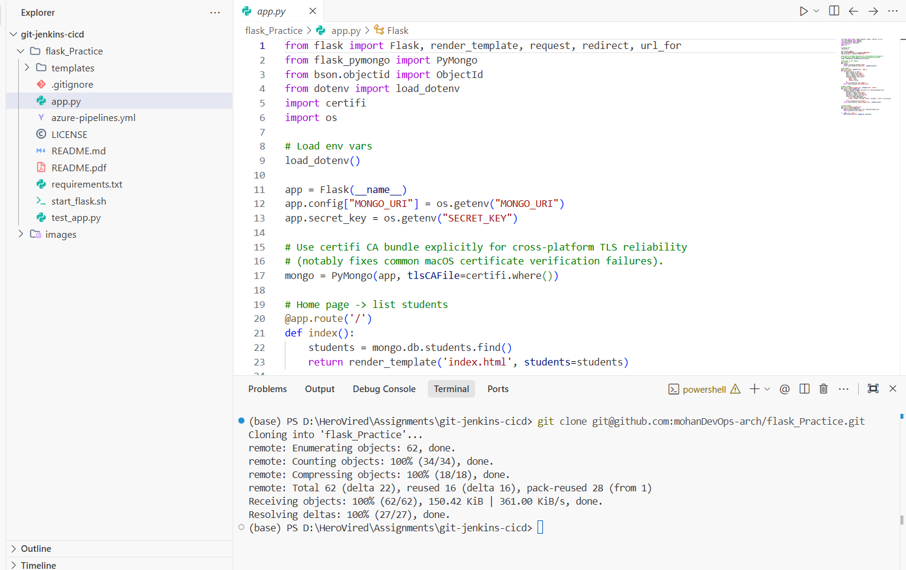

### Step 2: Establish Virtual Environment
Create and activate a clean Python virtual environment to manage dependencies:
```bash
# Windows
python -m venv venv
venv\Scripts\activate

# Linux / macOS
python3 -m venv venv
source venv/bin/activate
```
* **Step Verification Screenshot:**
  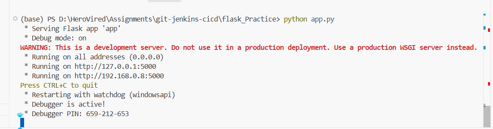

### Step 3: Create and configure a new mongodb cluster

* **Step Verification Screenshot:**
  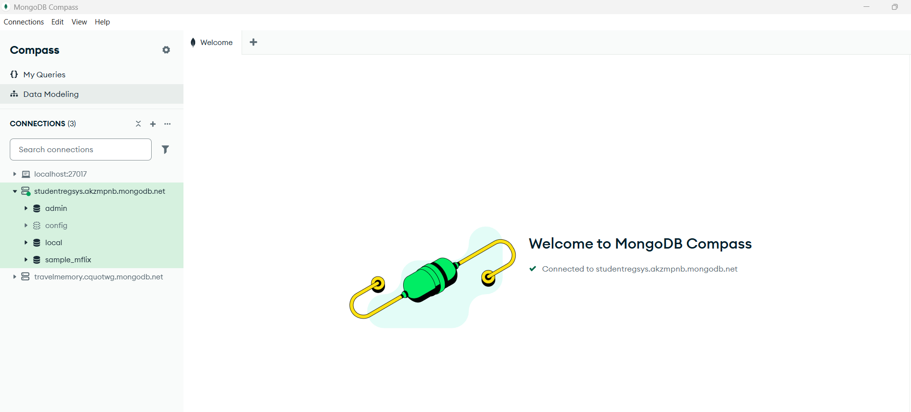
  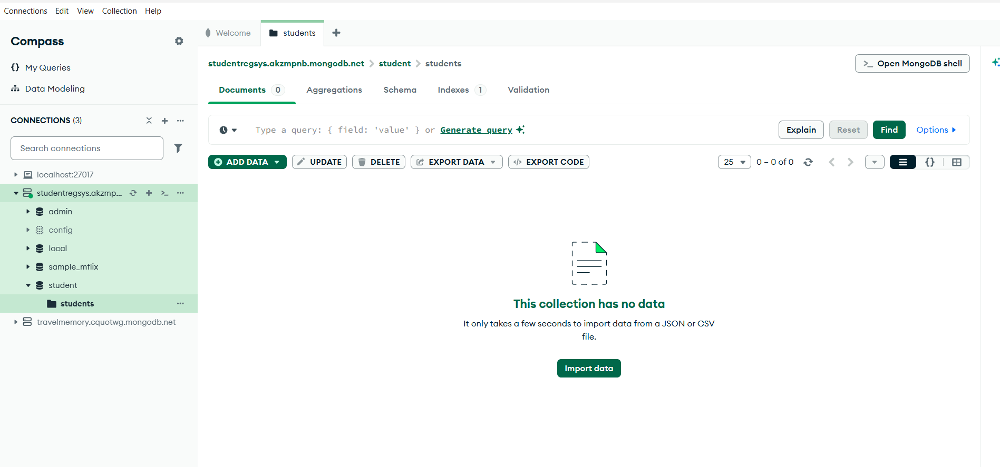

### Step 4: Install Required Dependencies
Install the required packages using pip:
```bash
pip install -r requirements.txt
```
### Step 5: Configure the Local Environment
Create a `.env` file in the `flask_Practice/` directory:
```env
MONGO_URI=mongodb+srv://studentregadmin:<password>@studentregsys.akzmpnb.mongodb.net/student?retryWrites=true&w=majority
SECRET_KEY=your_secure_random_key_here
```
### Step 6: Execute Unit Tests
Verify the environment sanity by running the test suite locally:
```bash
pytest test_app.py
```
* **Test Execution Screenshot:**
  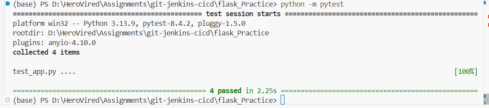

### Step 7: Start Flask Server
Run the Flask application entry point:
```bash
python app.py
```
* **Application Execution Console:**
  

---

## Web Application Visual Tour

The application provides a seamless experience for managing student registrations:

| View Page | Description | Interface Preview |
|---|---|---|
| **Main Dashboard / Student Directory** | Displays the list of registered students from MongoDB. Provides quick links to edit or delete any entry. | 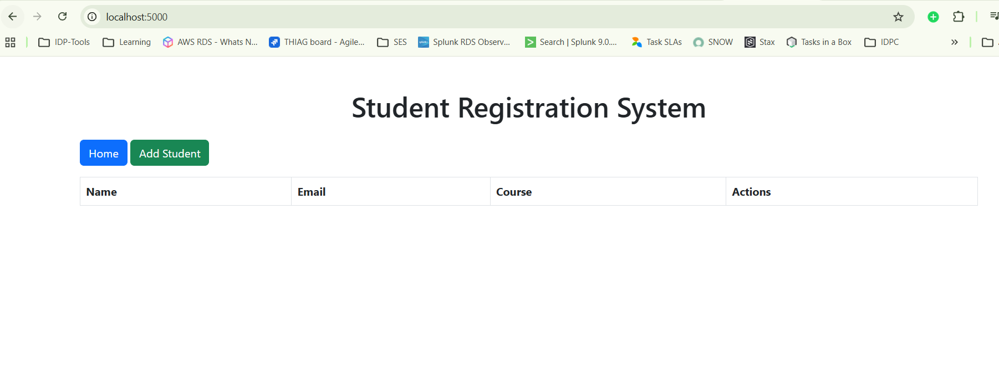 |
| **Add New Student** | A clean, form-based interface to input the student's name, email, course, and age. | 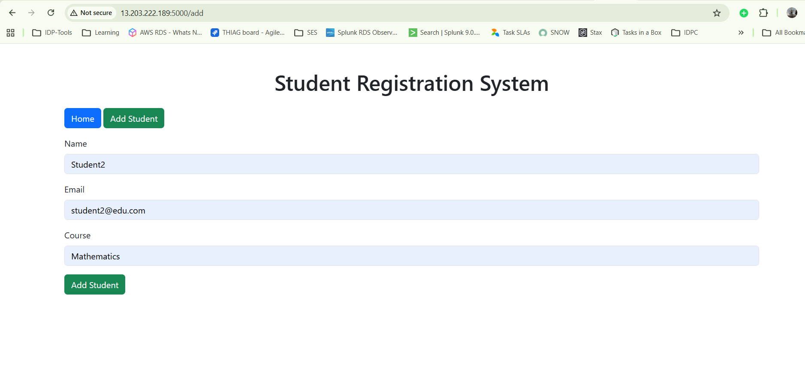 |
| **Validation & Submission** | Ensures data integrity on addition, displaying success notifications when students are registered. | 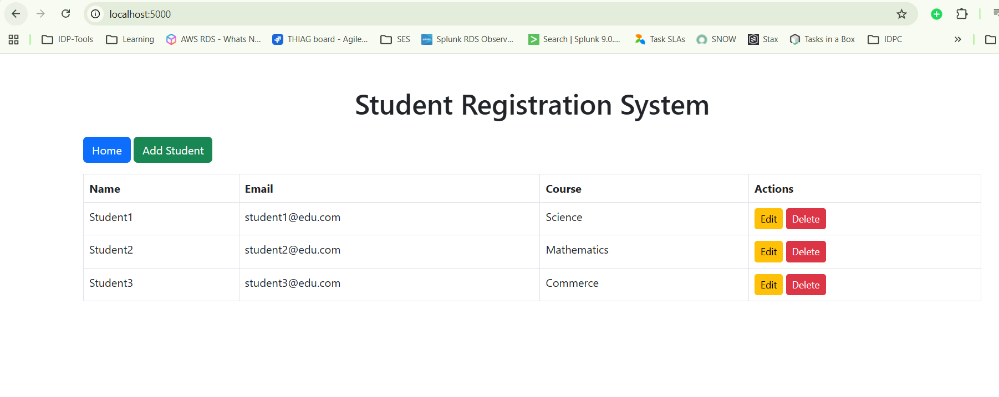 |
| **Update Student Details** | Pre-populates the student records allowing modifications to courses, names, or emails securely. | 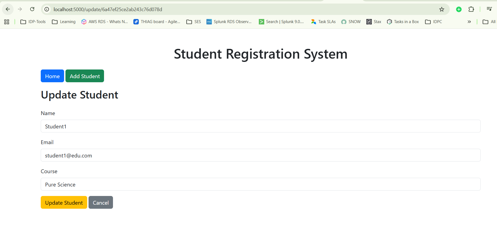 |
| **Delete Confirmation Dialog** | Safeguards data by requesting explicit confirmation before erasing records. | 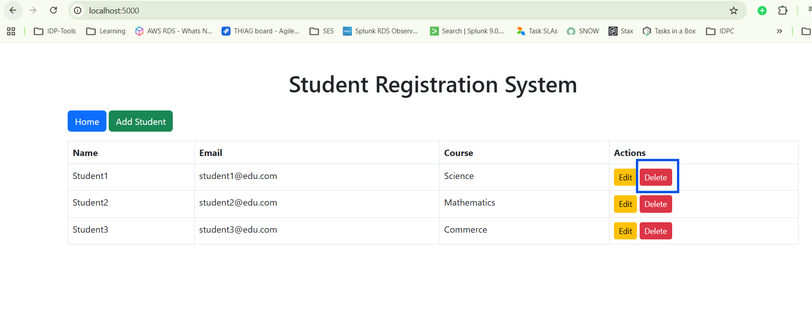 |
| **Database Sync Verification** | Records are seamlessly synced and persistent in the MongoDB Cloud Cluster. | 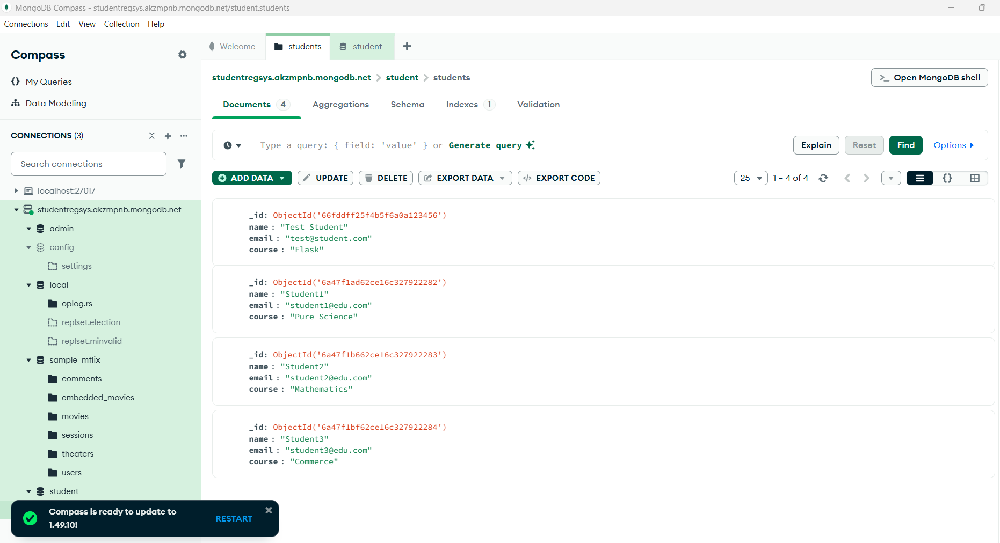 |

---

## The CI/CD Architecture Hub

This project is deployed automatically to **AWS EC2 Staging & Production environments** via two automated pipelines. Click on either pathway below to explore the detailed step-by-step setup guides, configurations, and pipeline executions.

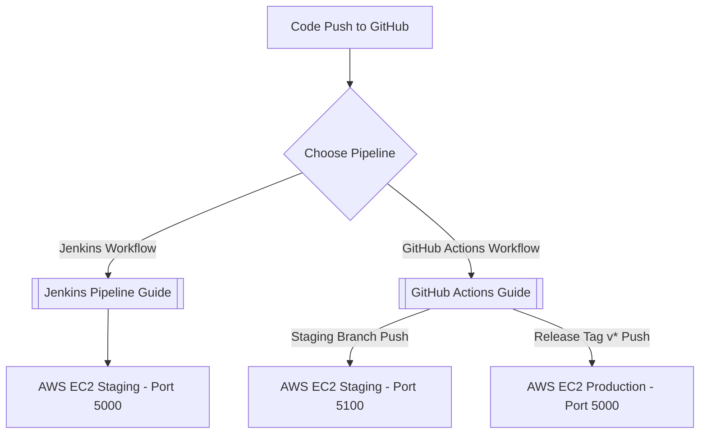

### Comparative Pipeline Matrix

| Feature / Detail | Jenkins CI/CD Pipeline | GitHub Actions CI/CD Pipeline |
|---|---|---|
| **Primary File** | [Jenkinsfile](file:///d:/HeroVired/Assignments/git-jenkins-cicd/Jenkinsfile) | [cicd.yml](file:///d:/HeroVired/Assignments/git-jenkins-cicd/.github/workflows/cicd.yml) |
| **Pipeline Style** | Declarative Jenkins Pipeline | GitHub YAML Workflows |
| **Trigger Mechanism** | GitHub Webhook (`githubPush()`) | Git Push & Pull Requests |
| **Environments** | Single Staging Target | Dual Environments: Staging & Production |
| **Target Ports** | Staging: **Port 5000** | Staging: **Port 5100** \| Production: **Port 5000** |
| **Notification Type** | SMTP Email Alerts (Gmail SMTP) | Native GitHub Job Summary logs |

---

> [!IMPORTANT]
> ### Pipeline Guides & Documentation Branches
> 
> Explore the detailed, step-by-step documentation for setting up, triggering, and verifying the pipelines:
> 
> * **[Jenkins CI/CD Pipeline Setup & Execution Guide](jenkinscicd_README.md)**
>   *Includes AWS EC2 provisioning details, Jenkins plugin installations, credential configurations, and successful/failure pipeline execution traces.*
> 
> * **[GitHub Actions CI/CD Pipeline Setup & Execution Guide](gitcicd_README.md)**
>   *Includes Environment settings, repository secret configurations, multi-branch triggering rules, and log verifications for staging (v5100) vs production (v5000) tag deployments.*

---

## 📄 License
This project is licensed under the terms of the **MIT License**.
