# Jenkins CI/CD Pipeline & AWS EC2 Deployment Guide

This document provides a comprehensive step-by-step guide for the automated CI/CD pipeline powered by **Jenkins**. It details the infrastructure setup on **AWS EC2**, configuration of credentials and plugins in Jenkins, webhook integration with **GitHub**, and the visual walkthrough of successful and failed pipeline executions.

---

## Pipeline Architecture & Flow

The declarative [Jenkinsfile](Jenkinsfile) is located at the root of the project. Whenever a developer pushes changes to the `main` branch, a GitHub Webhook triggers the Jenkins automation agent to run the following stages:

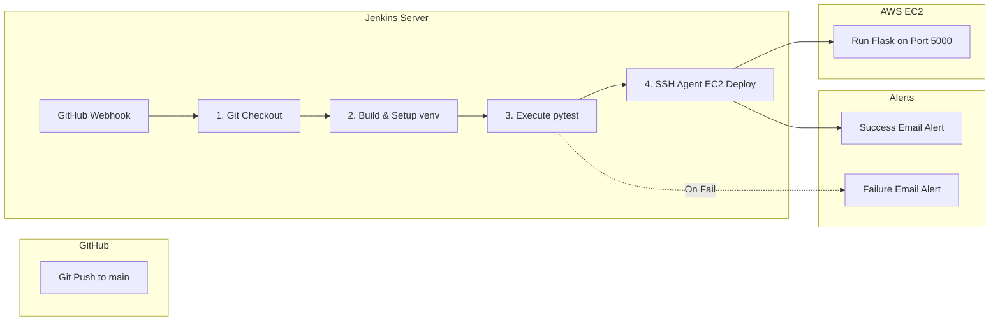

---

## Step 1: AWS EC2 Instance Provisioning

To host the staging deployment, we launch an Ubuntu EC2 virtual machine on AWS:

1. **Instance Launch & OS Selection:** Choose **Ubuntu Server** as the base AMI.
   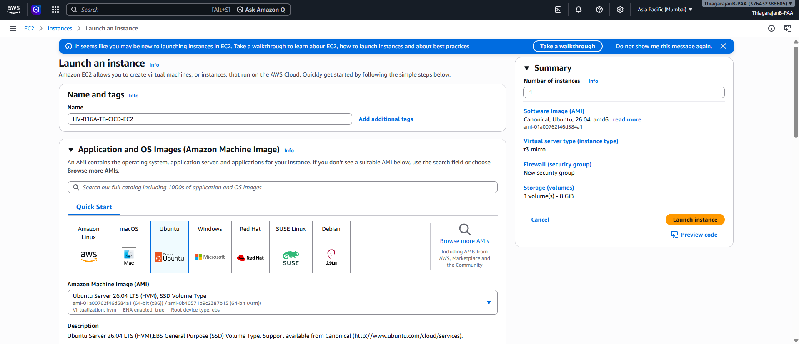
2. **Instance Sizing & Keys:** Select a `t2.micro` instance type and choose or create an RSA key pair (`.pem` file) for SSH login access.
   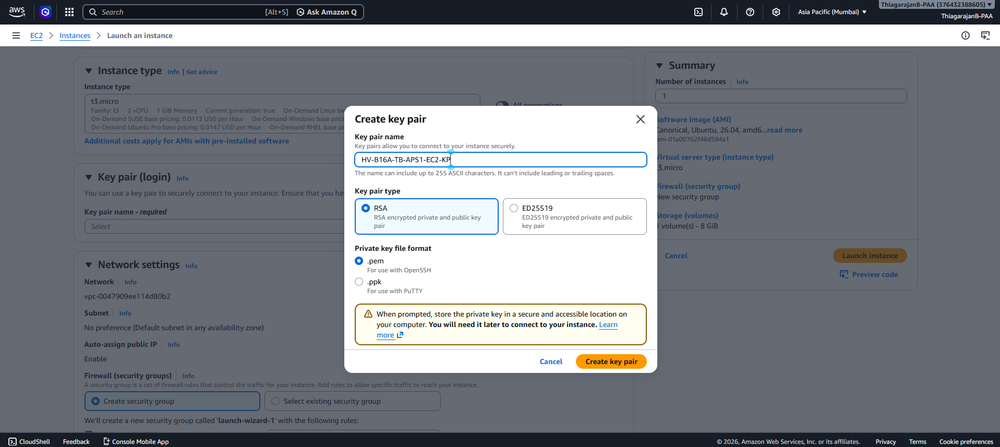
3. **Network Configuration:** Configure default subnet rules and enable public IP allocation.
   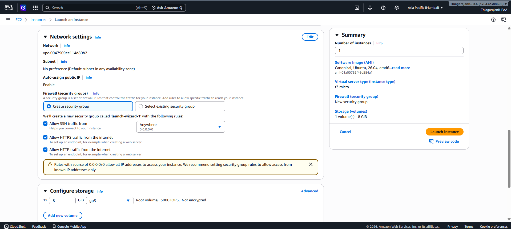
4. **Confirm Settings:** Review details and launch the instance.
   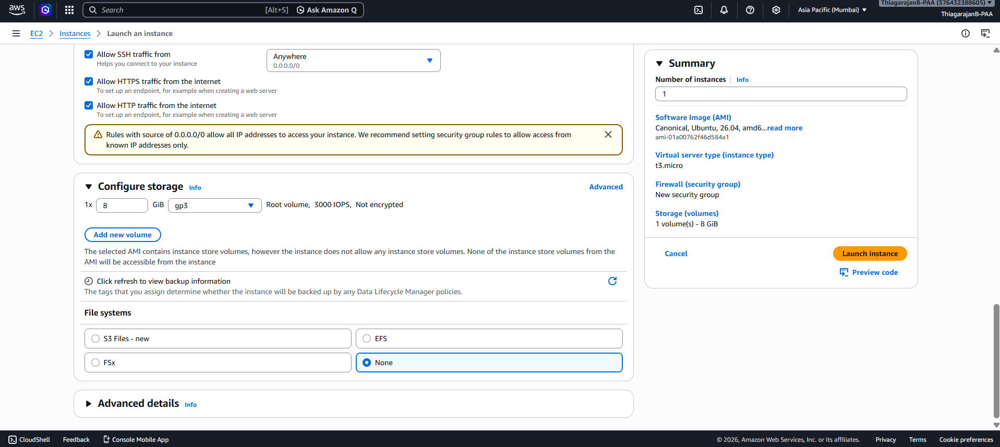
5. **Monitor EC2 State:** Verify the instance status goes from "Pending" to "Running" and note down its Public IPv4 address.
   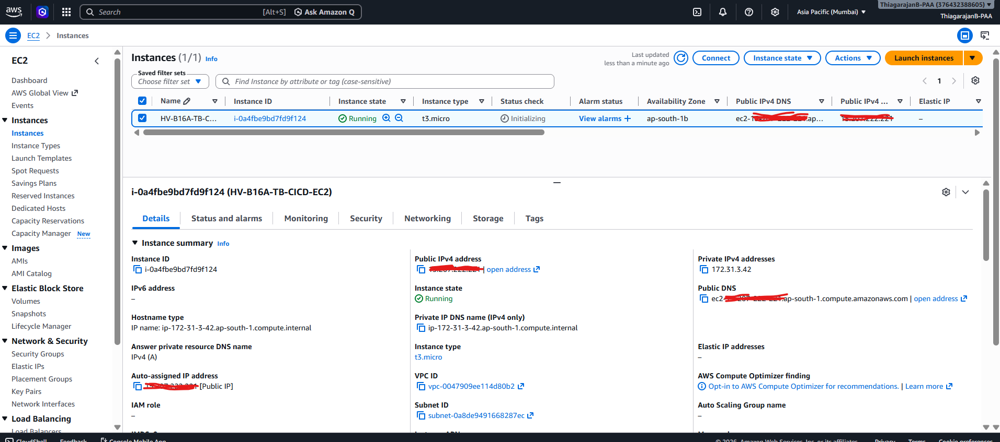
6. **Inbound Firewall Rules:** Go to the EC2 security group rules and add **Inbound Rules** to allow:
   * **SSH (Port 22)** for deployment access.
   * **Custom TCP (Port 5000)** for Flask web server access from anywhere (`0.0.0.0/0`).
   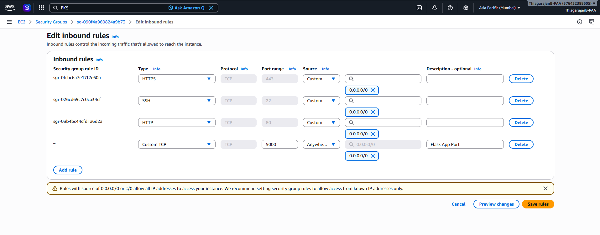

---

## Step 2: Jenkins Configuration & Credentials Setup

Before running the pipeline, Jenkins requires system dependencies, credentials, and notification configs.

### 1. Credentials Management
Navigate to **Manage Jenkins** -> **Credentials** -> **System** -> **Global credentials**. We add three essential credentials:
* **EC2 SSH Private Key (`HV-B16A-TB-EC2-Keypair`):** Add key as "SSH Username with private key" (`ubuntu` username + paste your `.pem` key content).
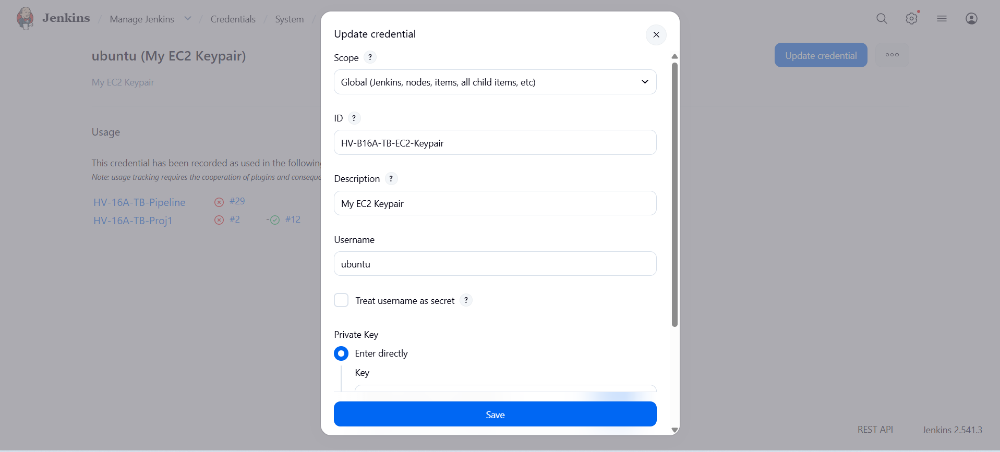
* **EC2 Secrets:** Store `EC2-IP` and `EC2-USER` as "Secret text" credentials.
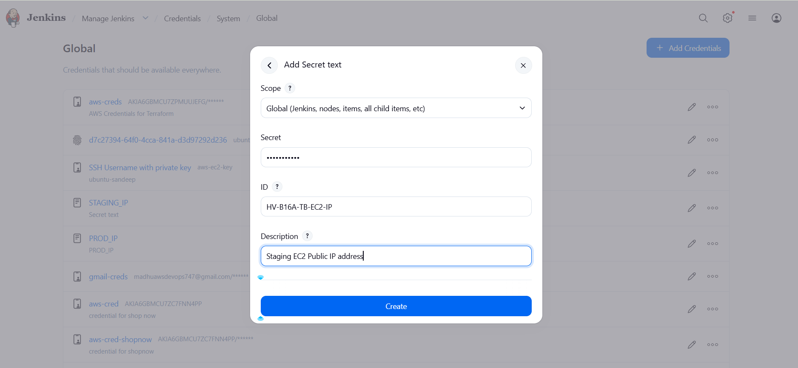
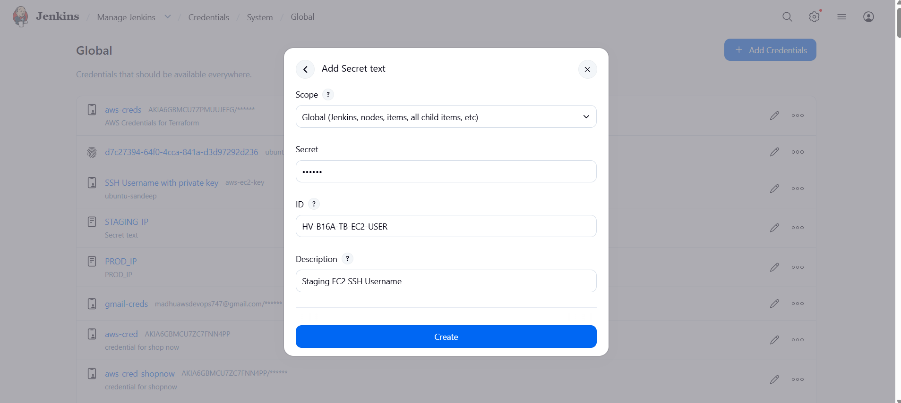
* **GitHub Checkout Key (`HV-B16A-TB-Git`):** Add GitHub private access tokens or SSH credentials for pulling code.
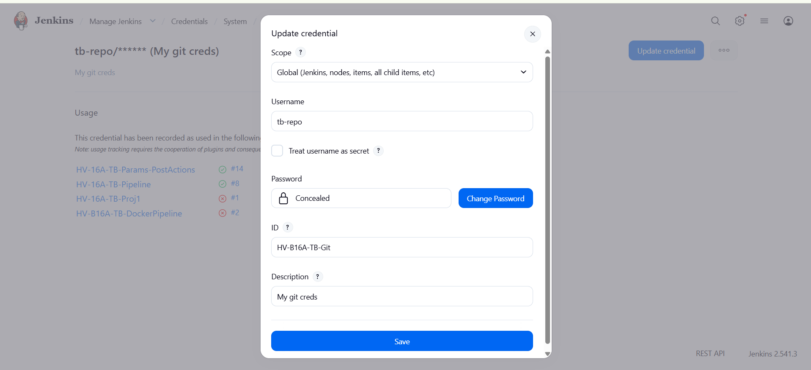
* **MONGO_URI & Secret Key:** Store the values in secret text credentials.
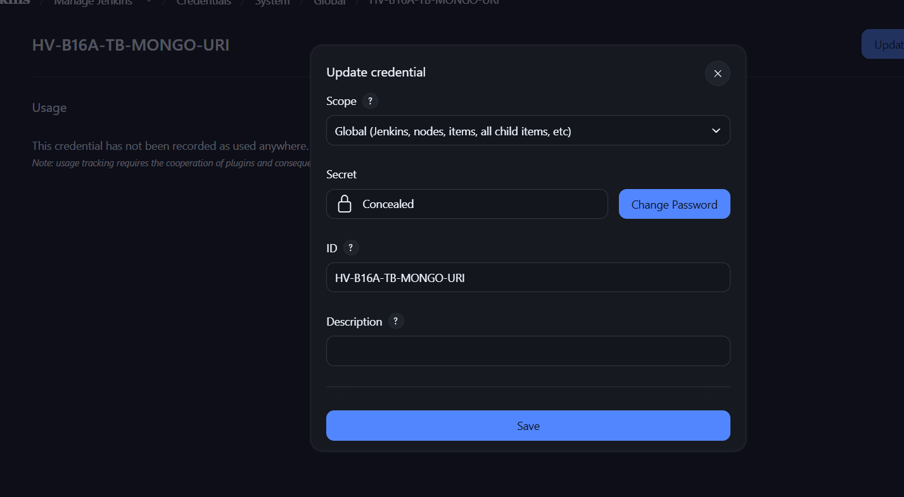
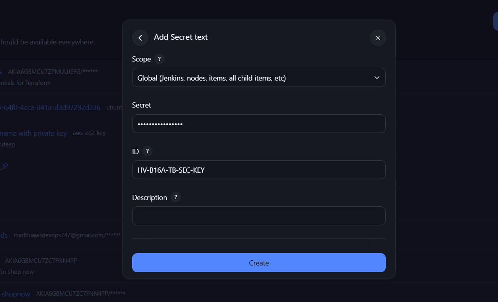

### 2. Required Plugins Setup
Ensure the following plugins are installed under **Manage Jenkins** -> **Plugins**:
* **SSH Agent Plugin** (crucial for staging copy tasks).
* **GitHub Integration Plugin** (for webhook trigger management).
* **JUnit Plugin** (for parsing and visualizing Pytest `.xml` test results).

### 3. SMTP E-mail Server Integration
To enable automated status emails, configure your SMTP server under **Manage Jenkins** -> **System** -> **E-mail Notification**:
* **SMTP Server:** `smtp.gmail.com`
* **Port:** `587` (TLS enabled)
* **SMTP Authentication:** Configure and use Gmail App Passwords.
* **Default Sender Address:** e.g., your-email@gmail.com
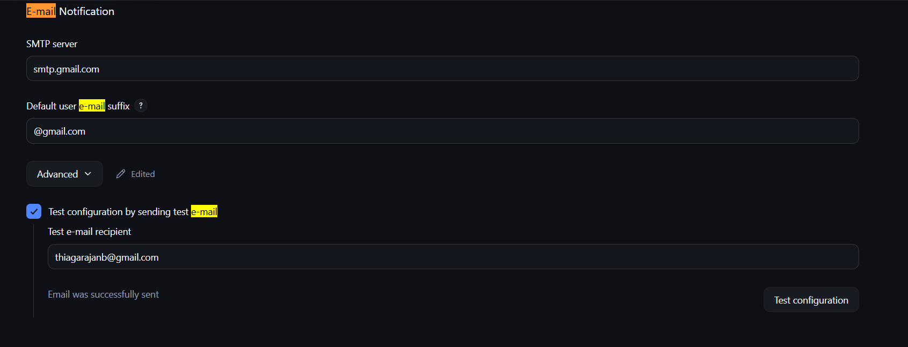

---

## Step 3: Jenkins Pipeline Job Creation

1. In Jenkins Home, click **New Item**, enter a name (e.g. `HV-B16A-TB-CICD-Assignment`), and select **Pipeline**.
2. **General Setup:** Provide a description and configure general rules.
   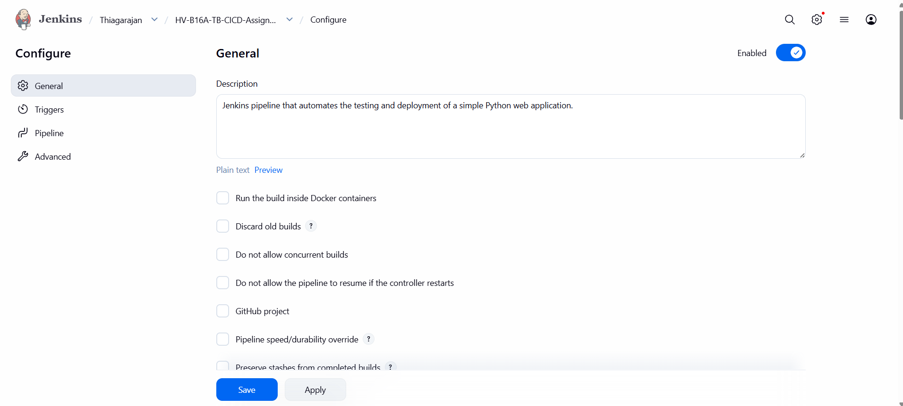
3. **Git Webhook Trigger:** Check **"GitHub hook trigger for GITScm polling"**.
   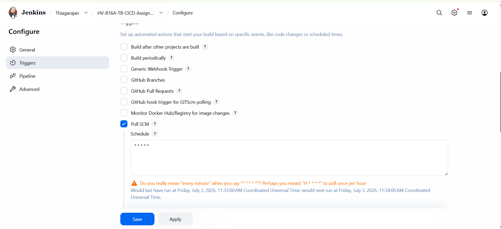
4. **Pipeline Configuration:**
   * Select **Pipeline script** or **Pipeline script from SCM**
   * If **Pipeline script from SCM** selected, then choose **Git** and supply repository URL `https://github.com/tb-repo/jenkins-git-cicd.git` and Git credentials.
   * Specify branch parameter as `*/main`.
   * Set **Script Path** to `Jenkinsfile`.
   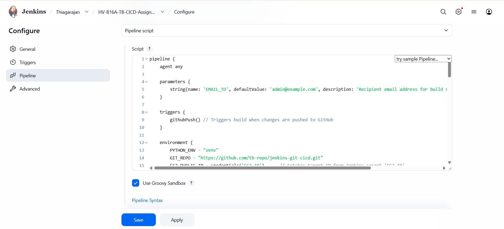
5. Once configurations are done. Save it. Now, whenever you push changes to the Git repository, Jenkins will automatically trigger the pipeline and execute the stages.

### Scenario A: Successful Pipeline Execution (Happy Path)
Every stage runs perfectly. Tests pass and the code is successfully copied to EC2 and deployed:

1. **Stage View:** Visual grid showing Checkout, Build, Test, and Deploy steps as green.
   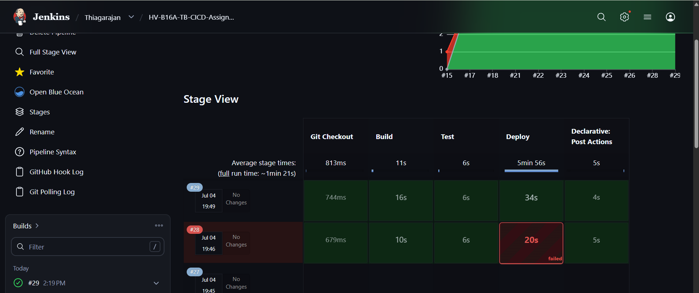
2. **Console Output:** The console output shows the logs of each stage and the final result of the pipeline ([Jenkins_successful_exec_log.txt](Jenkins_successful_exec_log.txt))
2. **Staging App verification:** The staging application launches on port 5000 and is fully accessible.
   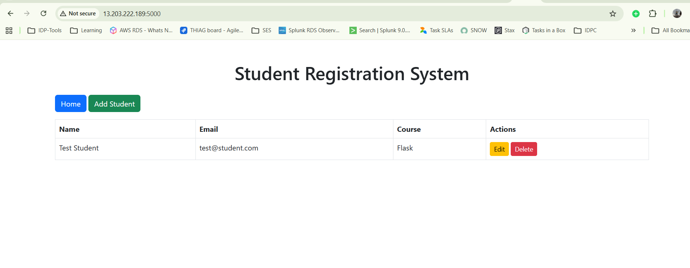
3. **Email Notification:** Recipient gets a confirmation email with direct link to build details.
   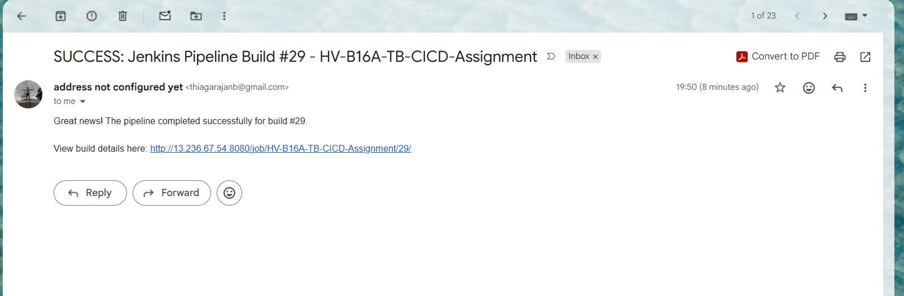

### Scenario B: Failed Pipeline Execution (Failing Test Case)
If a unit test fails, the pipeline aborts early to prevent deploying broken code:

1. **Stage View:** The **Test** stage turns red (Failed), and the **Deploy** stage is skipped (grey).
   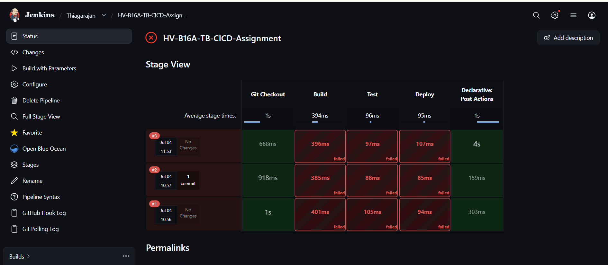
2. **Staging Safety:** The EC2 server remains unaffected (the older successful deployment continues running).
3. **Email Notification:** Jenkins sends an ALERT email indicating failure and links to console output for debugging.
   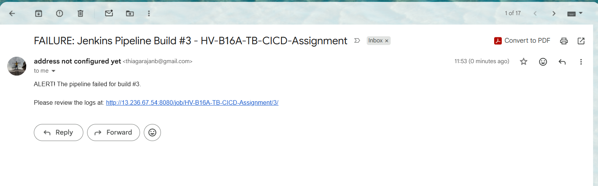

---

> [!TIP]
> ### 🔗 Useful Links
> * **[Root Jenkinsfile](Jenkinsfile)**
> * **[Main README.md Hub](README.md)**
> * **[GitHub Actions CI/CD Guide](gitcicd_README.md)**
